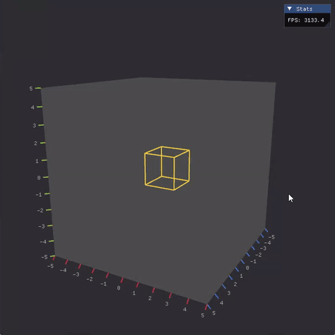
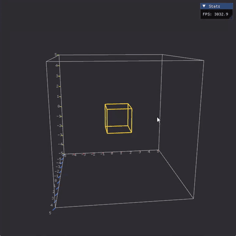

# GD Plotter

Work-in-progress 3D graph plotter in plain OpenGL. The goal is to visualize gradient descent on 3D loss surfaces.

Currently implemented: a matplotlib-style axis box with camera-dependent back panes, tick marks on the front-facing edges and screen-space labels.

<p align="center">
  
  &nbsp;
  
</p>
<p align="center"><sub><code>BACK</code> (left) and <code>FULL</code> (right) render modes while orbiting the camera</sub></p>

## Features

- **Axis box** with two render modes
  - `FULL`: wireframe box with ticks on the minimum edges
  - `BACK`: only the three back panes are drawn, ticks and labels sit on the front-facing edges. Pane and edge selection is derived from the camera octant without any per-frame buffer uploads, the vertical axis always lands on the left silhouette edge
- **Tick generation** decoupled from rendering (`plot::ticks`), extended Wilkinson labelling planned
- **Screen-space tick labels** with automatic fading
- **Orbit camera** (middle mouse drag to rotate, scroll to zoom)
- **Debug overlay** via Dear ImGui (FPS display)

## Build

Requirements: CMake ≥ 3.20, a C++20 compiler (`std::format` is used, so MSVC 2022, GCC 13+ or Clang 17+), OpenGL 3.3 capable driver.

GLFW, GLM and Dear ImGui are fetched automatically via `FetchContent`; GLAD is vendored in `external/`.

```sh
cmake -B build
cmake --build build --config Release
```

The binary is placed in `bin/<CONFIG>/` and loads shaders relative to that directory, so run it from there:

```sh
cd bin/RELEASE
./GD_Plotter
```

## Project layout

```
include/, src/
  graphics/         Renderer, Camera, OrbitControl, Shader, AxisBox, DebugCube
  plot/             Ticks (tick and edge selection logic), TextRenderer
assets/shaders/
external/glad/
```

## Roadmap

- Grid lines on the back panes
- Extended Wilkinson tick labelling
- Surface plots from a scalar function
- Gradient descent trajectories on the surface
- Cross-platform packaging (shader paths, install target)

## License

MIT, see [LICENSE.md](LICENSE.md). Third-party components are listed there as well.
